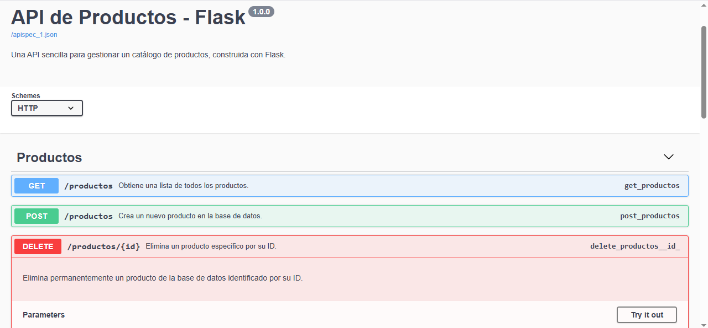

# API REST de Productos con Flask

Una API RESTful sencilla construida con Python y Flask para gestionar un catálogo de productos. Este proyecto demuestra la implementación de operaciones CRUD (Crear, Leer, Actualizar, Borrar), validación de datos, persistencia con SQLite, pruebas automatizadas con Pytest y documentación interactiva de la API con Swagger/OpenAPI a través de Flasgger.



## Características Principales

*   **Gestión Completa de Productos:** Operaciones CRUD para crear, leer, actualizar y eliminar productos.
*   **Validación de Datos:** Validación de los datos de entrada utilizando Marshmallow.
*   **Persistencia de Datos:** Uso de SQLite como base de datos a través de Flask-SQLAlchemy.
*   **Serialización de Datos:** Conversión de objetos Python a JSON y viceversa con Flask-Marshmallow.
*   **Documentación Interactiva de API:** Especificación OpenAPI generada y visualizada con Flasgger (Swagger UI).
*   **Pruebas Automatizadas:** Pruebas unitarias y de integración para los endpoints de la API utilizando Pytest.
*   **Manejo de Errores:** Implementación de manejadores de error para respuestas consistentes.

## Tecnologías Utilizadas

*   **Python 3.x**
*   **Flask:** Microframework web para construir la API.
*   **Flask-SQLAlchemy:** Extensión para el uso de SQLAlchemy con Flask (ORM para SQLite).
*   **Flask-Marshmallow:** Extensión para la integración de Marshmallow con Flask (serialización y validación).
*   **Marshmallow-SQLAlchemy:** Para generar esquemas Marshmallow a partir de modelos SQLAlchemy.
*   **Flasgger:** Para generar documentación OpenAPI/Swagger UI.
*   **Pytest:** Framework para escribir y ejecutar pruebas.
*   **Pytest-Flask:** Extensión para facilitar las pruebas de aplicaciones Flask.
*   **SQLite:** Base de datos ligera basada en archivos.
*   **Git:** Sistema de control de versiones.

## Configuración y Ejecución Local

Sigue estos pasos para configurar y ejecutar el proyecto en tu máquina local.

### Prerrequisitos

*   Python 3.8 o superior.
*   Pip (gestor de paquetes de Python).
*   Git.

### Pasos de Instalación

1.  **Clona el repositorio:**
    ```bash
    git clone https://github.com/https://github.com/Ramaa128/api-productos-flask-o-flask-products-api 
    ```

2.  **Navega al directorio del proyecto:**
    ```bash
    cd api-productos-flask-o-flask-products-api
    ```

3.  **Crea y activa un entorno virtual:**
    *   En macOS/Linux:
        ```bash
        python3 -m venv venv
        source venv/bin/activate
        ```
    *   En Windows:
        ```bash
        python -m venv venv
        .\venv\Scripts\activate
        ```

4.  **Instala las dependencias:**
    Asegúrate de tener el archivo `requirements.txt` en la raíz del proyecto (lo creamos con `pip freeze > requirements.txt`).
    ```bash
    pip install -r requirements.txt
    ```

### Ejecución

1.  **Ejecuta la aplicación Flask:**
    ```bash
    python app.py
    ```
    La API estará disponible en `http://127.0.0.1:5000`.

## Documentación de la API

La documentación interactiva de la API (Swagger UI) está generada por Flasgger y se puede acceder una vez que la aplicación está en ejecución.

*   **URL de Swagger UI:** [http://127.0.0.1:5000/apidocs/](http://127.0.0.1:5000/apidocs/)

Desde esta interfaz, puedes ver todos los endpoints, sus parámetros, cuerpos de solicitud esperados, respuestas y probarlos directamente.

## Ejecutar las Pruebas

Las pruebas están escritas con Pytest. Para ejecutarlas:

1.  Asegúrate de que tu entorno virtual esté activado y tengas las dependencias de desarrollo instaladas (Pytest ya está en `requirements.txt`).
2.  Desde la raíz del proyecto, ejecuta:
    ```bash
    pytest -v
    ```

## Endpoints de la API (Resumen)

*   `POST /productos`: Crea un nuevo producto.
*   `GET /productos`: Obtiene una lista de todos los productos.
*   `GET /productos/{id}`: Obtiene un producto específico por su ID.
*   `PUT /productos/{id}`: Actualiza un producto existente por su ID.
*   `DELETE /productos/{id}`: Elimina un producto por su ID.

<!-- 
## Estructura del Proyecto (Opcional)

    api-productos-flask/
    ├── app.py              # Lógica principal de la aplicación Flask y endpoints
    ├── config.py           # Configuración de la aplicación (ej. URI de la BD)
    ├── models.py           # Definiciones de modelos SQLAlchemy (Producto)
    ├── schemas.py          # Definiciones de esquemas Marshmallow (ProductoSchema)
    ├── tests/              # Carpeta con las pruebas automatizadas
    │   ├── __init__.py
    │   └── test_app.py     # Pruebas para los endpoints de la API
    ├── instance/           # Carpeta para la base de datos SQLite (productos.db)
    ├── venv/               # Entorno virtual (ignorado por Git)
    ├── .gitignore          # Especifica archivos y carpetas a ignorar por Git
    ├── requirements.txt    # Dependencias del proyecto
    └── README.md           # Este archivo
-->

<!-- 
## Autor

*   **[Ramiro Mastrocola]** - [Ramaa128](https://github.com/Ramaa128) 
    
-->

<!-- 

Este proyecto está bajo la Licencia MIT. Ver el archivo [LICENSE](LICENSE) para más detalles.